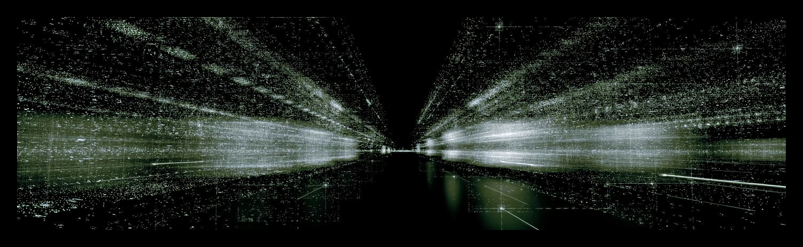

<p align="center">
  
</p>

## About Me

---

```yaml
# ~/.config/ariel.yaml

name: Ariel Arévalo Alvarado
role: AI Enablement Engineer
location: Heredia, Costa Rica
interests:
  - Agentic Systems Architectures
  - AI Enablement/Acceleration
  - AI Safety & Security
  - Ops & Automation
  - AI Research
```

---

## Tech Stack

```sh
$ cat tech_stack.txt
Languages         :: Python, TypeScript, SQL, Bash
ML / NLP          :: PyTorch, Keras, Scikit-learn, DeBERTa, classical NLP (NER, PII, BM25)
Agent stack       :: LangChain, LangGraph, MCP, AWS Bedrock AgentCore, Claude Agent SDK
Data / Infra      :: Apache Spark, GCP Dataproc, Azure ML, FastAPI, Docker
Tooling           :: Langfuse, LiteLLM, MLflow, OpenTelemetry
Coding Agents     :: Claude Code, OpenCode
```

---

## Selected Work

- Ariel Arévalo Alvarado. *[Moral Licensing Comprehension: Measuring Flexibility of Social Prediction in LLMs](https://www.kaggle.com/competitions/kaggle-measuring-agi/writeups/new-writeup-1776217592304).* Solo submission to the Google DeepMind/Kaggle "Measuring Progress Toward AGI" competition, Social Cognition track. 2026.
- K. Villalobos-Solís, E. Víquez-Mora, A. Badilla-Olivas, E. Vílchez-Lizano, **A. Arévalo-Alvarado (Senior Author)**. *Multimodal Foundation Models for Zero-Shot User Activity Classification.* [JOCICI](https://jocici2026.citic.ucr.ac.cr/programa/), 2026.
- **Ariel Arévalo Alvarado**, A. Acuña Castillo, A. Sánchez Ramírez, E. A. Sibaja Li. *[ClimateFact: A RAG workflow for climate change fact verification](https://github.com/arielarevalo/climatefact/blob/main/paper/climatefact_en.pdf).* University of Costa Rica, 2025.

---

## [Resume](./assets/resume.pdf)
